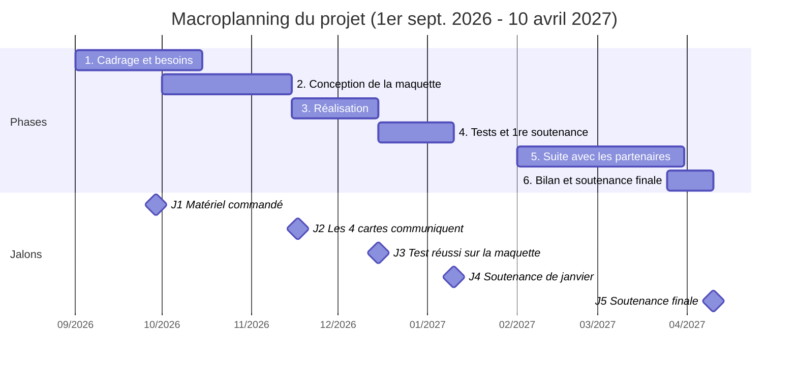

# Macroplanning — Projet 2A Bus CAN (Groupe 69)

```mermaid
gantt
    title Macroplanning du projet (1er sept. 2026 - 10 avril 2027)
    dateFormat YYYY-MM-DD
    axisFormat %m/%Y
    todayMarker off

    section Phases
    1. Cadrage et besoins              :p1, 2026-09-01, 2026-10-15
    2. Conception de la maquette       :p2, 2026-10-01, 2026-11-15
    3. Réalisation                     :p3, 2026-11-15, 2026-12-15
    4. Tests et 1re soutenance         :p4, 2026-12-15, 2027-01-10
    5. Suite avec les partenaires      :p5, 2027-02-01, 2027-03-31
    6. Bilan et soutenance finale      :p6, 2027-03-25, 2027-04-10

    section Jalons
    J1 Matériel commandé               :milestone, 2026-09-29, 0d
    J2 Les 4 cartes communiquent       :milestone, 2026-11-17, 0d
    J3 Test réussi sur la maquette     :milestone, 2026-12-15, 0d
    J4 Soutenance de janvier           :milestone, 2027-01-10, 0d
    J5 Soutenance finale               :milestone, 2027-04-10, 0d
```
